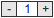

jQuery Numberic Input Plugin
====================

A numberic input plugin for jquery. `-` and `+` buttons included.

> ***Preview:*** 

How To
--------------------

The simplest usage:

```javascript
$(element).numbericInput(5);
```

Or you can pass an object:

```javascript
$(element).numbericInput({
    number      : 5,
    min         : 1,
    max         : 10,
    onChange    : function(val) {
        alert("New value: " + val);
    }
});
```

> ***Notice:*** `element` should be an `<div></div>`

You can also call this function:

```javascript
var value = $(element).numbericInput("getVal");
```

> What's more, you can customize `css` file by your self.
